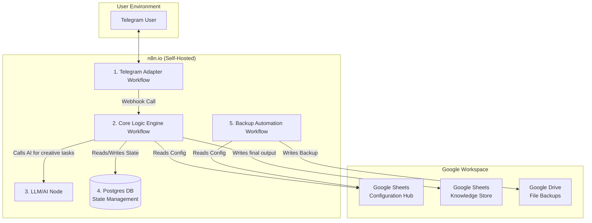

# High-Level Design (HLD)

**Project Name:** Eldoraigne Automations & Chatbot  
**Version:** 4.1  
**Last Updated:** 26 June 2025  

---

## 1. Core System Architecture

### 1.1. Architectural Pattern: The "Platform-Agnostic Adapter" Model  
The system is composed of two distinct types of n8n workflows:
- **Adapters:** Lightweight workflows for specific chat platforms (e.g., Telegram). They translate messages between the platform and the Core Engine.
- **Core Engine:** A single, platform-agnostic workflow that contains all business logic, state management, and connections to data sources.

### 1.2. High-Level Design (Component Diagram)


### 1.3. Technology Stack & Security Model  
- **Workflow Automation:** n8n.io (Community Edition, Self-Hosted)  
- **State Management:** Postgres SQL Database  
- **Primary Chat Interface:** Telegram  
- **LLM Provider:** Google AI (Gemini Pro)  
- **Google Workspace Integration (Security Model):**
    - A dedicated, non-human **Google Service Account** will be used for all interactions with Google Workspace.
    - Access will be granted on a resource-by-resource basis by sharing specific Google Drive folders, Google Sheets, or Google Calendars with the Service Account's unique email address.
- **Credentials Management:** All sensitive credentials will be stored exclusively within n8n's encrypted Credentials store.

---

## 2. Infrastructure & Operations

### 2.1. Hosting & Portability  
- **Current Hosting:** The n8n instance and Postgres database are currently hosted on Render.  
- **Portability:** The architecture is designed to be portable. A migration to a different hosting provider would primarily involve migrating the Postgres database and re-configuring the n8n environment variables.

### 2.2. Backup & Disaster Recovery  
- **Configuration Files (Google Sheets):** A dedicated, scheduled n8n workflow (`Backup Automation`) will run nightly. It will read each sheet from the Configuration Hub and save a timestamped `.csv` version to a dedicated "Backups" folder in Google Drive.
- **State Database (Postgres):** The primary backup mechanism for the state database will be the automated backup feature provided by the hosting platform (Render).

### 2.3. Future State: CI/CD Pipeline  
- **Vision:** To enable automated deployment of n8n workflows from the GitHub repository to the n8n instance using the `n8n-cli` and GitHub Actions.
- **Status:** This is a future requirement and is not in the scope of the initial build.

---

## 3. Project Execution Framework

### 3.1. Phase 1: Requirements Gathering  
- The Project Lead provides a set of `Business Requirements`.
- The AI Solutions Architect translates these into formal documentation (BRS, HLD, LLD) and asks clarifying questions to ensure all details are captured.
- This phase concludes when the Project Lead approves the final set of requirements documents.

### 3.2. Phase 2: Build  
- The AI Solutions Architect provides step-by-step instructions for the Project Lead to implement the requirements.
- This includes creating and configuring accounts (e.g., Google Service Account), setting up files and folders (e.g., Google Sheets), and providing the `JSON` for n8n workflows.
- This phase focuses on one work item at a time.
- If a technical challenge requires a change to the design, the process reverts to Phase 1 to update the documentation before proceeding.

### 3.3. Phase 3: Testing (To Be Detailed)  
- The Project Lead will test the implemented feature to ensure it meets the requirements.
- (Further details on test cases and user acceptance criteria will be defined here in a future release).

### 3.4. Phase 4: Release  
- After successful testing, the Project Lead will issue the command: **"This is approved. Prepare the release for commit."**
- The AI Solutions Architect will generate the complete, final "Commit Package" containing all changed project artifacts.
- The Project Lead is responsible for committing these final artifacts to the GitHub repository, which marks the formal conclusion of the work item.

---

## 4. Changelog  
- **v1.0 - v2.1:** Established core architecture, security model, and initial development processes.  
- **v3.0:** Added sections for Infrastructure & Operations, including Hosting, Backup & Disaster Recovery, and a vision for a future CI/CD pipeline.  
- **v4.0:** Formalized the "Project Execution Framework" (Requirements, Build, Test, Release) to structure the project lifecycle.  
- **v4.1 (Current):** Corrected Markdown formatting for nested Mermaid diagram to resolve rendering issues.
```
